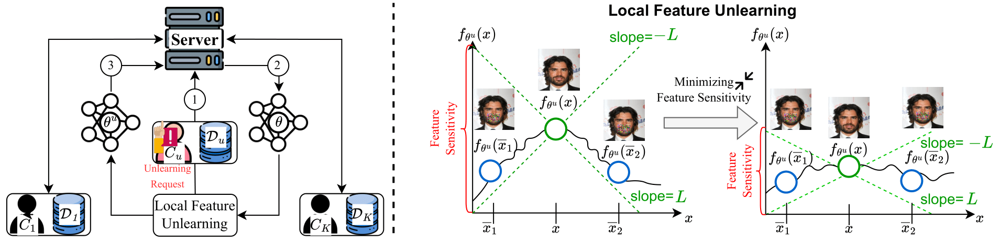
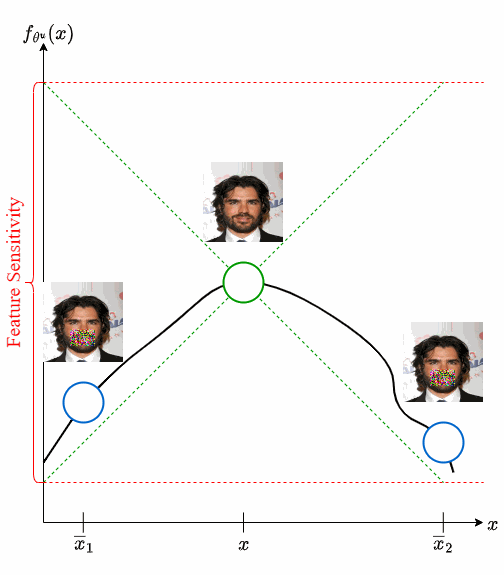

# Federated Feature Unlearning

[ArXiv](https://arxiv.org/abs/2405.17462) | Supplementary Material | Poster

### Official pytorch implementation of the paper: "Ferrari: Federated Feature Unlearning via Optimizing Feature Sensitivity"

#### NeurIPS 2024

[]((https://arxiv.org/abs/2405.17462))
[](https://badges.toozhao.com/stats/01J9P2R033FHASG7RVP6QSTE3P "Get your own page views count badge on badges.toozhao.com")

#### (Released on October 08, 2024)

## Introduction

The advent of Federated Learning (FL) highlights the practical necessity for the 'right to be forgotten' for all clients, allowing them to request data deletion from the machine learning model's service provider. This necessity has spurred a growing demand for Federated Unlearning (FU). Feature unlearning has gained considerable attention due to its applications in unlearning sensitive features, backdoor features, and bias features. 

Existing methods employ the influence function to achieve feature unlearning, which is impractical for FL as it necessitates the participation of other clients in the unlearning process. Furthermore, current research lacks an evaluation of the effectiveness of feature unlearning. 

<p align="center"> 
<p align="center"> Figure 1: Overview of our proposed Federated Feature Unlearning framework. </p>

To address these limitations, we define feature sensitivity in the evaluation of feature unlearning according to Lipschitz continuity. This metric characterizes the rate of change or sensitivity of the model output to perturbations in the input feature. We then propose an effective federated feature unlearning framework called Ferrari, which minimizes feature sensitivity. Extensive experimental results and theoretical analysis demonstrate the effectiveness of Ferrari across various feature unlearning scenarios, including sensitive, backdoor, and biased features.

<p align="center"> 
<p align="center"> Figure 2: Illustration demonstrating the optimization of feature sensitivity for achieving feature unlearning. </p>

## Getting started

### Preparation

Before executing the project code, please prepare the Python environment according to the `requirement.txt` file. We set up the environment with `python 3.9.12` and `torch 2.0.0`. 

```python
pip install -r requirement.txt
```

### How to run

**1. Federated Model Training**

- Default ResNet-18 model for image datasets and a fully-connected neural network linear model for tabular datasets.

```python
python fl_training_main.py -gpu -train_mode backdoor -dataset Cifar10 -trigger_label 0 -trigger_size 5 -global_epochs 200 -local_epochs 5 -batch_size 128 -lr 0.0001  -client_num 10 -frac 0.4 -momentum 0.5 -optimizer 'sgd' -seed 0 -report_training -save_model 
```

- Fine-tune hyperparameters make sure model achieves convergence during training

**2. Federated Feature Unlearning and Evaluation**

```python
python unlearn_main.py -gpu -unlearning_scenario backdoor -dataset Cifar10 -trigger_label 0 -trigger_size 5 -sample_number 20 -min_sigma 0.05 -max_sigma 1.0 -lr 0.00001 -client_num 10 -batch_size 128 -seed 0 -save_model 
```

- To achieve optimal feature unlearning results, adjust hyperparameters like `lr` and `batch_size`, as they may vary across different unlearning scenarios and datasets.

## Citation
If you find this work useful for your research, please cite
```bibtex
@inproceedings{ferrari,
               title={Ferrari: Federated Feature Unlearning via Optimizing Feature Sensitivity}, 
               author={Hanlin Gu and WinKent Ong and Chee Seng Chan and Lixin Fan},
               journal={Advances in Neural Information Processing Systems},
               year={2024},
}
```

## Feedback
Suggestions and opinions on this work (both positive and negative) are greatly welcomed. Please contact the author by sending an email to
`winkent.ong@um.edu.my` or `cs.chan at um.edu.my`

# License and Copyright

The project is open source under BSD-3 license (see the `LICENSE` file).

©2024 Universiti Malaya.
